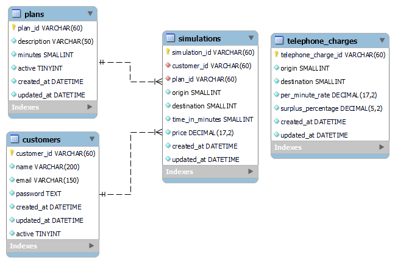

# **FaleMais Spring API**

## Sobre
[Desafio UAUBox Brasil](./requirements/challenge/Dev+Backend+-+Desafio.pdf)\
Aplicação com objetivo de resolver o desafio proposto utilizando os seguintes requisitos:
* Ser desenvolvido em Java com Spring Boot. 
* Orientação a objetos. 
* Clareza, boas práticas e organização de código.
* Utilizar GIT para versionamento de código.
* Adicione um arquivo README.md com os requisitos básicos e procedimentos para executar a
  aplicação.
#### Opcional  
* Utilização de testes unitários
* Uso avançado da linguagem e/ou framework.

## DER

## Casos de Uso
* [SignUp (Cadastro de Clientes)](./requirements/signup.md)
