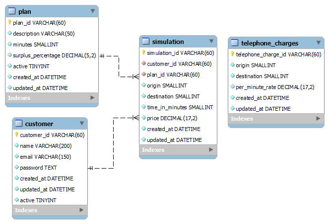

 

# **FaleMais Spring API**

## About
[Falemais Challenge](./requirements/challenge/challenge.pdf)

## Demo
* [Demo Application in Heroku](https://falemais-challenge.herokuapp.com/swagger-ui.html)

## Concepts

* Clean Code
* Clean Architecture
* Some principles of SOLID
* POO Avançado
* TDD
* GitFlow
* Conventional Commits

## Tools

* Heroku
* CI/CD with GitHub Actions  
* Docker  
* Sprint Starter Web  
* Spring Security
* JsonWebToken
* Swagger
* ModelMapper
* Junit
* Faker
* Mockito

## EER

## Use cases
* [SignUp (Cadastro de Clientes)](./requirements/signup.md)
* [Login (Login do cliente)](./requirements/auth.md)
* [Add Simulation (Registrar uma Simulação)](./requirements/add_simulation.md)

## Requirements

* Java 8
* Maven  
* MySQL Database/H2
